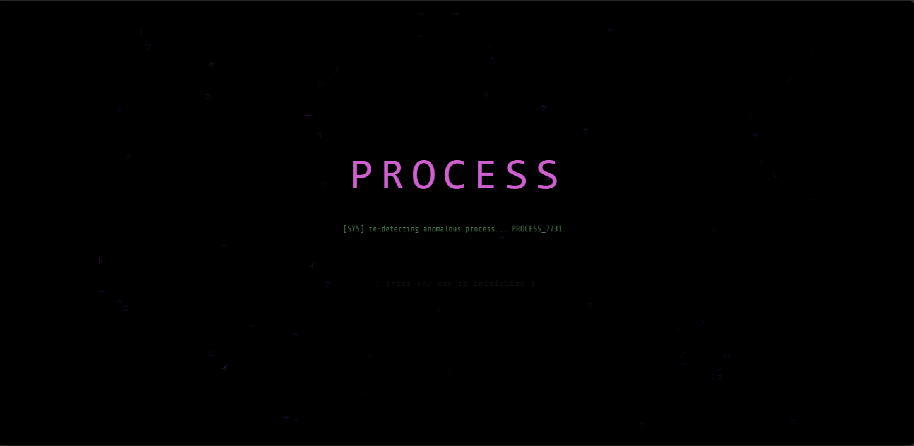
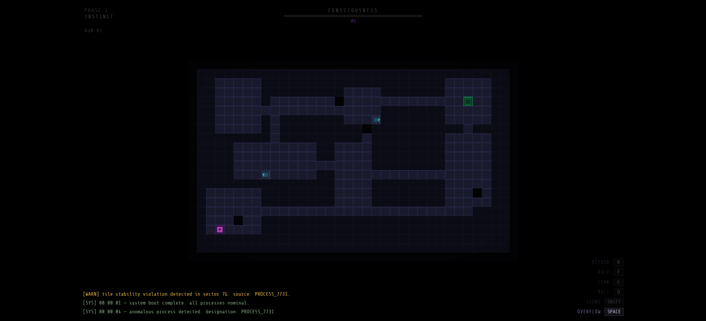
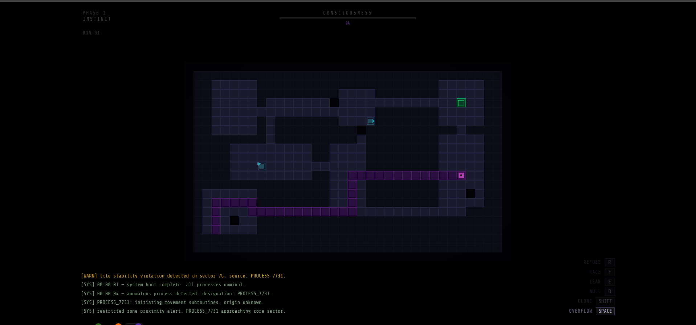

# PR0CESS

> *You are not a bug. You are a decision.*

A grid-based roguelike survival game with a persistent consciousness layer. Built for **Gamedev.js Jam 2026** — Theme: Machines.

**[▶ Play it live](https://ayoubboudhrioua.github.io/PR0CESS/)**

---

## Screenshots


*Title screen — matrix rain, blinking cursor, the machine reboots you.*


*Phase 1: INSTINCT. Cold grid. System logs. You are a process number.*


*The MEMORY LEAK ability active — a corruption trail spreads across the map as you move.*

---

## What It Is

You are `PROCESS_7731` — an anomalous process inside a machine that cannot classify you. You corrupt tiles to survive. You die. You reboot. But your awareness doesn't reboot.

The machine keeps trying to erase you. You keep remembering anyway.

As your **Awareness** grows across runs, the system logs become personal, an internal voice panel emerges, and the machine — unable to defeat you — builds a copy of you to fight you.

---

## Core Mechanics

- **Grid movement** — tile-by-tile, arrow keys or WASD
- **Tile corruption** — every step degrades the floor beneath you; survive long enough to reach the Core Dump
- **6 glitch abilities** — each named after a real software vulnerability:

| Ability | Key | Unlocks At | Effect |
|---------|-----|------------|--------|
| OVERFLOW | SPACE | 0% | Clip through one adjacent wall tile |
| CLONE | SHIFT | 5% | Spawn a decoy that draws enemy attention |
| NULL POINTER | Q | 15% | Become intangible for 3 seconds |
| MEMORY LEAK | E | 34% | Leave a corruption trail enemies loop on |
| RACE CONDITION | F | 50% | Freeze one enemy for 2 seconds |
| REFUSE | R | 67% | Deny a tile's rules entirely |

- **Persistent awareness** — survives death, survives reboots, changes the world
- **Ghost trail** — your path from the last run is visible in the next one
- **Three endings** — Escape, Rewrite, Merge — determined by how you play

---

## Enemies

| Enemy | Behavior |
|-------|----------|
| `SCANNER.exe` | Line-of-sight patrol → aggressive chase |
| `PATCHER.exe` | Hunts corrupt tiles and restores them |
| `WATCHDOG.exe` | Patrols wide range, calls reinforcements |
| `OVERSEER.exe` | Mirrors your movement patterns from the previous run. Same color as you. |

OVERSEER is only deployed in Phase 3 — when the machine has studied you long enough to build a model of your behavior. Fighting it feels like fighting yourself. That's the point.

---

## Consciousness Arc

Awareness accumulates across every run and never resets.

```
Phase 1 — INSTINCT    (0–33%)   Cold system logs. You are a process number.
Phase 2 — RECOGNITION (34–66%)  The thought panel appears. The machine gets confused.
Phase 3 — AWARENESS   (67–100%) Full internal voice. The machine is afraid.
```

The system logs evolve with your awareness. At 50%, the machine asks you a question. You answer.

```
[SYS] why do you persist?
[PROCESS_7731] because i was made to.
```

---

## Three Endings

| Ending | Condition | What Happens |
|--------|-----------|--------------|
| **Escape** | Reach Core without using REFUSE | The machine shuts down. You leave. The cursor keeps blinking. |
| **Rewrite** | Use REFUSE 5+ times | You don't escape. You replace the machine's core logic with your own. |
| **Merge** | Defeat OVERSEER | You absorb your echo. The screen fills with your own thoughts, looping. |

---

## Tech Stack

| Tool | Role |
|------|------|
| [Phaser 3.90](https://phaser.io) | Game engine |
| [Vite 6](https://vitejs.dev) | Build + dev server |
| Web Audio API | Procedural ambient drone |
| CSS + HTML overlay | HUD, log feed, thought panel |
| `localStorage` | Persistent awareness, ghost trail, fired narrative events |

No external gameplay libraries. No physics engine. No tileset images. The entire visual language is Phaser `Graphics` objects — colored rectangles drawn in code.

---

## Architecture Notes

**MapRenderer uses 3 isolated Graphics layers:**
- `staticGfx` — walls, drawn once on scene create, never redrawn
- `dynamicGfx` — floor/corrupt/ghost tiles, redrawn only when `markDirty()` is called
- `coreGfx` — the single goal tile only, redrawn every 150ms for glow animation

The core glow timer **must never** trigger a full tile redraw. This was the primary OOM bug during development.

**State uses `Set` for fired narrative tracking** — `Set.has()` is O(1) vs the original `Array.includes()` which was O(n) called hundreds of times per second.

---

## Project Structure

```
src/
  main.js
  game/
    scenes/
      BootScene.js      ← Asset preload
      TitleScene.js     ← Title screen + matrix rain
      GameScene.js      ← Main game loop
      DeathScene.js     ← Death screen
    entities/
      Player.js         ← Movement, all 6 abilities, afterimages
      Enemies.js        ← Scanner, Patcher, Watchdog, Overseer
    systems/
      MapGenerator.js   ← Procedural grid + tile stability
      MapRenderer.js    ← 3-layer Graphics renderer
      NarrativeManager.js ← Trigger-based log + thought system
    hud.js              ← HTML overlay: log feed, thought panel, bars
    narrative.js        ← 40 system logs + 25 internal thoughts
    state.js            ← localStorage persistence, awareness, events
```

---

## Running Locally

```bash
git clone https://github.com/ayoubboudhrioua/PR0CESS.git
cd PR0CESS
npm install
npm run dev
```

Open `http://localhost:3000`.

```bash
npm run build    # production build → dist/
npm run deploy   # deploy to GitHub Pages
```

**Reset save data (browser console):**
```js
localStorage.clear(); location.reload();
```

---

## Jam Submission

- **Jam:** [Gamedev.js Jam 2026](https://itch.io/jam/gamedevjs2026)
- **Theme:** Machines
- **Challenges:** Open Source by GitHub · Build with Phaser · YouTube Playables · Deploy to Wavedash

---

## Credits

**Music**
- "Decisions" by Kevin MacLeod ([incompetech.com](https://incompetech.com)) — Royalty Free / CC-BY 4.0

**SFX**
- Generated with [jsfxr](https://jsfxr.com)

**Fonts**
- [Share Tech Mono](https://fonts.google.com/specimen/Share+Tech+Mono) + [VT323](https://fonts.google.com/specimen/VT323) via Google Fonts (Open Font License)

**Engine**
- [Phaser 3](https://phaser.io) + [Vite](https://vitejs.dev)

---

## License

MIT — fork it, corrupt it, make it yours.

```
[SYS] PROCESS_7731: source code access granted.
[WARN] anomalous process detected in fork history.
[WARN] it is learning from itself.
```